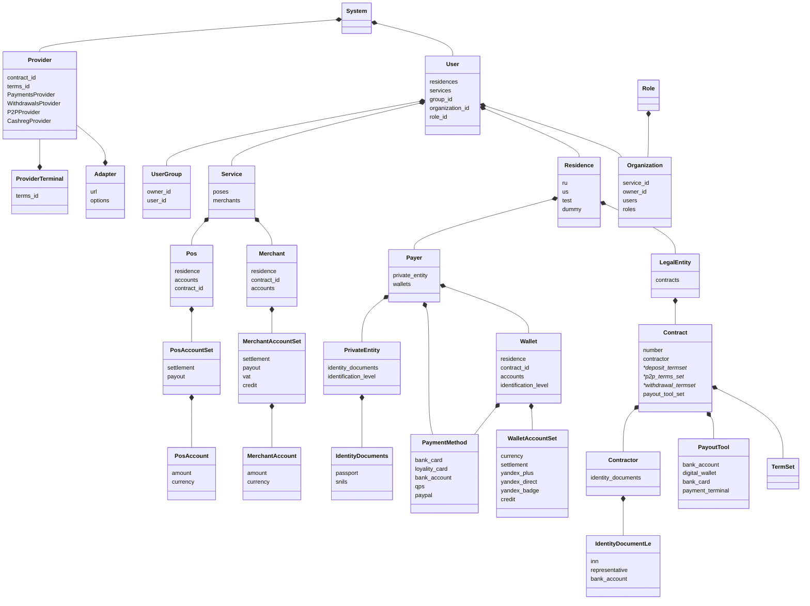
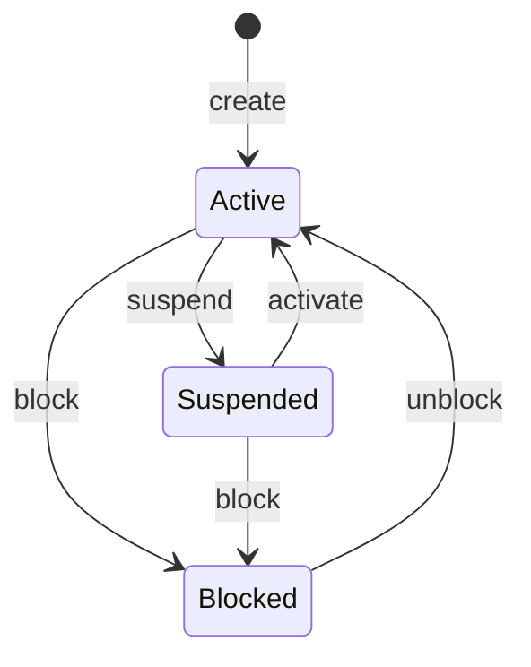
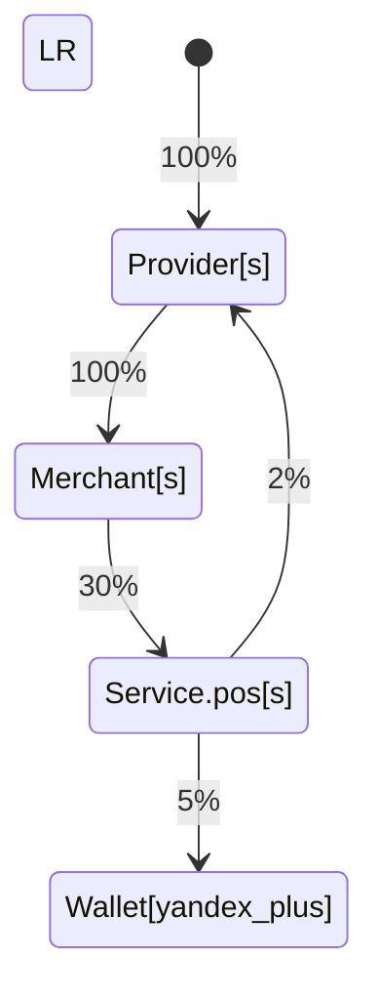
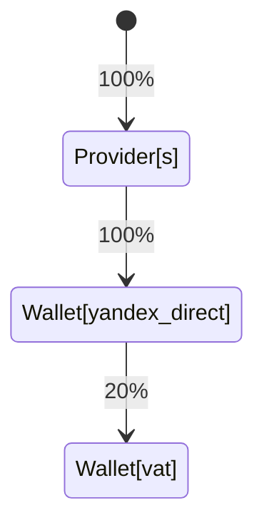
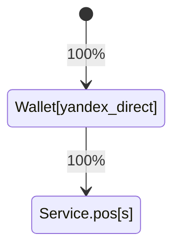
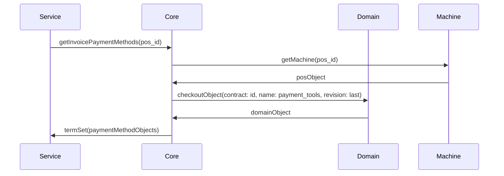

# Лекция первая

## Сущности коммерческой модели

- описание модели рыночных отношений как торгового ряда и прилавка товаров


- User - отображение реальной личности, Payer - плательщик может не совпадать с юзером (по крайней мере у нас нет способов узнать это с гарантией уверенности)

## Детальная схема сущностей

- диаграммой классов



## Конечные автоматы сущностей

- каждая изменяемая сущность - это почти всегда детерминированный конечный автомат, то есть имеет один вход, один выход и в каждый момент времени находится только в одном состоянии, а перейти из текущего состояния он может только в определенное следующее
- изменение состояния сущности производится добавлением в нее соответствующего ивента, все ивенты сохраняются, и мы всегда можем видеть историю, а последний ивент описывает состояние сущности
- то есть это ивент сорсинг паттерн в чистом виде, он хорош не только тем, что сохраняет историю изменений автомата, но и отлично подходит для репликации данных через очереди, что идеально ложится на хайлоад и асинхронку
- изменение состояния сущности верхнего порядка должно автоматически транзакционно вызывать перевод в то же состояние всех зависимых от него сущностей (угадайте почему)
- автомат, как некий айдишник и пейлоад в виде списка ивентов очень хорошо ложится на KV схему хранения, что дает нам те же хайлоад плюшки
- очень хорошо на ивент сорсинг ложится пример с самозанятыми - в какой-то момент в сущность `user` можно записать событие вида `legal_entity.ru.tax_status.self_employed[active: true, active_since: datetime]` и таким образом обогатить ее знанием о том, что налоговые ставки в проводках ядра нужно учитывать с этим статусом, также обратный ивент, который снимает этот статус хорошо ложится на модель

### User
    
- диаграмма переходов состояний



- пример наборов событий для `User`

```yaml
- created_at: '2021-06-23 00:00:00Z'
  event_id: 1
  payload:
    user_changes:
    - user_created:
        created_at: '2021-06-23 00:00:00Z'
        user_id: 38a1318d-72a2-45ee-9347-5c71f21c5b6a
        user_info: 
          email: user@example.com
          yandex_uid: 1104754f-7e9b-46f1-866d-ae82160dca1e
    - residence_bound: 
      created_at: '2021-06-23 00:00:00Z'
      residence_id: test
    - legal_entity_created: 
      created_at: '2021-06-23 00:00:00Z'
      legal_entity_id: ed1e8dd1-1c77-47c9-81f5-b3e507b030c6
    - contract_created: 
      created_at: '2021-06-23 00:00:00Z'
      id: c5d131b0-afac-4332-b159-12c1f95987d6
      contract_id: c5d131b0-afac-4332-b159-12c1f95987d6
    - contract_modified:
        contract_id: c5d131b0-afac-4332-b159-12c1f95987d6
        created_at: '2021-06-23 00:00:00Z'
        modification:
          legal_entity_binding: 
            legal_entity_id: ed1e8dd1-1c77-47c9-81f5-b3e507b030c6
    - contract_modified:
        contract_id: c5d131b0-afac-4332-b159-12c1f95987d6
        modification:
          term_set_binding: 
            term_set_id: f121df37-5515-4245-ab6a-e7f440a254c4
      created_at: '2021-06-23 00:00:00Z'
    - contract_modified:
        contract_id: c5d131b0-afac-4332-b159-12c1f95987d6
        created_at: '2021-06-23 00:00:00Z'
        modification:
          payout_tool_modification:
            modification:
              payout_tool_created:
                currency:
                  payout_tool_info:
                    russian_bank_account: 
                      account: 01234567890123456789
                      bank_bik: '123456789'
                      bank_name: OOO TESTBANK
                      bank_post_account: 01234567890123456789
                  symbolic_code: RUB
                payout_tool_id: 787c49d9-e0c9-43c5-b7de-5eb68389844b
- created_at: '2021-06-23 00:00:00Z'
  event_id: 2
  payload:
    created_at: '2021-06-23 00:00:00Z'
    suspended:
      since: '2021-06-23 00:00:00Z'
- created_at: '2021-06-23 00:00:00Z'
  event_id: 3
  payload:
    activated:
      since: '2021-06-23 00:00:00Z'
    created_at: '2021-06-23 00:00:00Z'
```

- pos
- merchant
- payer
- wallet

у них примерно такой же набор состояний, кроме счета - его еще можно закрывать, там похожий, но отличающийся БП

- account

## Движение денежных средств

- план счетов (очень упрощенный - у такси, например в плане около 90 счетов(!)), его нужно уметь свободно расширять через админку
- внутри системы все ДДС производятся исключительно по двухстадийной схеме (HOLD+COMMIT/ROLLBACK), в лекции о нюансах реализации это станет ясно зачем

```yaml
user
    service
        pos
            settlement
            payout
        merchant
            settlement
            payout
            vat
            credit
    payer
        wallet
            settlement
            credit
            yandex_plus
            yandex_direct
            yandex_badge
    provider
        settlement
```

## Сущности конфигурации домена

- версионирование конфигурации и привязка к версии
- возможные проблемы объема конфигурации несущественны, даже через 5 лет с учетом самых жирных сервисов, которые постоянно меняют конфиг, конфигурация в JSON формате будет занимать десятки мегабайт, в сериализованном бинарном еще меньше, в архиве - мегабайты
- отдельный сервис хранения с поддержкой пулл-реквестов
- свой DSL с расширениями

### Шаблон комиссий и финансовых условий сервиса, мерчанта и кошелька

- мерчантский и сервисный набор условий и ограничений
- достаточен для отдачи наружу, например списка доступных платежных методов (сиквенс)
- достаточен для 1 фазы обработки платежного трафика - расчет комиссий и условий

```yaml
service
    pos
        contract
            $ref: terms_id
    merchant
        contract
            $ref: terms_id
```

- пример набора условий в TermSet

```yaml
term_set:
    currencies:
        - rub
        - usd
        - dummyy
    payment_tools:
        bank_card:
            payment_system:
                - visa
                - master
                - nspk
            tokenized_bank_card:
                payment_system:
                    - visa
                token_provider:
                    - applepay
                    - googlepay
                    - yandexpay
        terminal_provider:
            - qps
        digital_wallet:
            - yandex_plus
    cash_limit:
        lower:
            currency:
                rub:
                    amount: 500 000
        upper:
            currency:
                rub:
                    amount: 10 00
    holds:
        lifetime:
            value:
                seconds: 3600
    refunds:
        - cash_flow_template
    partial_refunds:
        - cash_flow_template
        - limit
    recurrent_paytools:
        currency:
            - rub
        cash_value:
            amount: 199 #размер привязки, хотя скоро это МПСы отменят
    payments:
        cash_flow_template:
            source: merchant.settlement
            destination: pos.settlement
            share:
                p: 30
                q: 100
            source: pos.settlement
            destination: wallet.settlement
            share:
                p: 5
                q: 100
            of: operation_amount #комиссия от суммы платежа
--- alt ---
        cash_flow_template:
            source: merchant.settlement
            destination: pos.settlement
            share:
                p: 30
                q: 100
            of: surplus #верхняя комиссия, взымается к дополнению к сумме оплаты
--- /alt ---
    payouts:
        cash_flow_template:
            source: merchant.settlement
            destination: merchant.payout
            share:
                p: 100
                q: 100
            source: merchant.settlement
            destination: pos.settlement
            fixed:
                cash_value:
                    amount: 100 00
        payout_schedules:
            ref: 1
```

## Шаблон проводок

- идеальная модель для описания любых финансовых условий, комиссий, распределения денег по счетам
- хорошо визуализируется на веб интерфейсах, позволяет передать конфигурирование тарифов техподдержке
- при учете того, что ядро процессинга может дернуть внешний сервис для обогащения данных (пример с `binbase` или пример с режимом налогообложения для самозанятых) для выбора той или иной ветки проводок
- челлендж: описать бизнес-процесс любого сервиса и попробовать переложить его на шаблон проводок

```yaml
cash_flow_template
    source
        account
    destination
        account
    share
        p: int
        q: int
```

## Расширенная схема конфигурации

- поддержка условных операторов и комбинирующие сущности

```
decisions
    if
    then
constant
    bool
predicates
    is_not
    all_of
    any_of
conditions
    currency_is
    payment_tool
    bin_data
definitions
    bank_card
        issuer_bank_is
        payment_system_is

```

- примеры комбинированных условий

```yaml
terms
    payments
        decisions
            if
                condition
                    payment_tool
                        bank_card
                            definition
                                bank_card
                                    issuer_bank_is
                                        "*SBER*"
            then
                cash_flow_template
                    *reduced interchange

```

- нераскрытые сущности конфигурации домена
    - inspector
        - antifraud
        - limit
    - cashreg_provider
    - withdrawal_provider
    - p2p_provider
    - calendar

### Граф финансовых потоков

- маркет



- драйв
    - 1 часть - пополнение общего счета Директа



- 2 часть - чарджинг со счета Директа



### План проводок на основе шаблона проводок

- на примере драйва, план и номера счетов

```yaml
service.pos: drive
service.merchant: alik
service.provider: sber
user.payer: vasya

service.pos.drive.settlement: 1000
service.pos.drive.merchant.alik.settlement: 2000
service.provider.sber.settlement: 3000
user.payer.vasya.yandex_plus: 500000
```

- транзакция системы управления счетами и балансами

| Source                                     | Destination                                | Amount | Currency |
| ------------------------------------------ | ------------------------------------------ | ------ | -------- |
| service.provider.sber.settlement           | service.pos.drive.merchant.alik.settlement | 100   | RUB       |
| service.pos.drive.merchant.alik.settlement | service.pos.drive.settlement               | 30    | RUB       |
| service.pos.drive.settlement               | service.provider.sber.settlement           | 2     | RUB       |
| service.pos.drive.settlement               | user.payer.vasya.yandex_plus               | 5     | RUB       |


- ивент лог системы управления балансами (дата операции и прочее в отдельном обсуждении)

```
account_id                        | 1000 | 2000 | 3000 | 500000
---------------------------------------------------------------
 posting_batch.id_posting_plan.id |      | +100 | -100 |      
 posting_batch.id_posting_plan.id | +30  | -30  |      |
 posting_batch.id_posting_plan.id | -2   |      | +2   |           
 posting_batch.id_posting_plan.id | -5   |      |      | +5
---------------------------------------------------------------
balance                           |  23  |  70  | -98  |  5
```
    

### Шаблон кешфлоу и финансовых условий провайдера терминала

- подход такой же как в условиях для мерчантов и сервисов
- именно здесь настраиваются проводки для провайдера (первая из графа), потому что только после роутинга будет известен его ид, а соответственно и комиссия в конкретном провайдере (или терминале)

```yaml
provider
    term_set
        payments
            cash_flow
                source
                    pos.settlement
                destination
                    provider.settlement
                share
                    p: 2
                    q: 100
```

- пример переопределения настроек, был мир, стала виза

```yaml
provider
    alfabank
        term_set
            payment_tools
                bank_card
                    nspkmir
        terminal
            term_set
                payment_tools
                    bank_card
                        visa

```

### Версионирование конфигурации

- если изменились условия, то новые инвойсы будут ссылаться на них
- для корректировки условий используется сущность "корректирующая проводка", в таком случае к платежу в инвойсе добавляется еще один платеж, но уже с постинг планом, ссылающимся на другую ревизию (то есть `createAdjustmentEntry(invoice.id, payment.id, domain_revision_id)`)
- в идеале - реализовать схему пулл-реквест флоу гитхаба с ревью, код овнерами и пр.
- пример чекаута конфигурации домена с получением списка доступных платежных методов еще даже до старта платежа:





### Роутинг

- в общем случае задача роутинга - сматчить pos сервиса со списком доступных терминалов
- это можно выразить отдельной структурой

```yaml
provider
    terminal
        id: 1234
         route_set: 123
    terminal
        id: 1567
```

```yaml
user
    service
        id: 10
        pos
            id: 1001

```

```yaml
    route_set
        id: 123
        decisions
            any_of
                terminal
                    id: 1234
                    weight: 1 [1..10] #10% трафика
                    fallback_priority: 1 #основной
                terminal
                    id: 1567
                    fallback_priority: 2 #автоматический резерв
                    weight: 9 #90% трафика
            conditions
                service_is
                    id: 10
                pos_is
                    id: 1001

```

- на этом общая модель сущностей закончена
- в следующей лекции уже появятся платежи и финансовые потоки
- инвойсы
- платежи
- выплаты
- генерация реестров и актов
