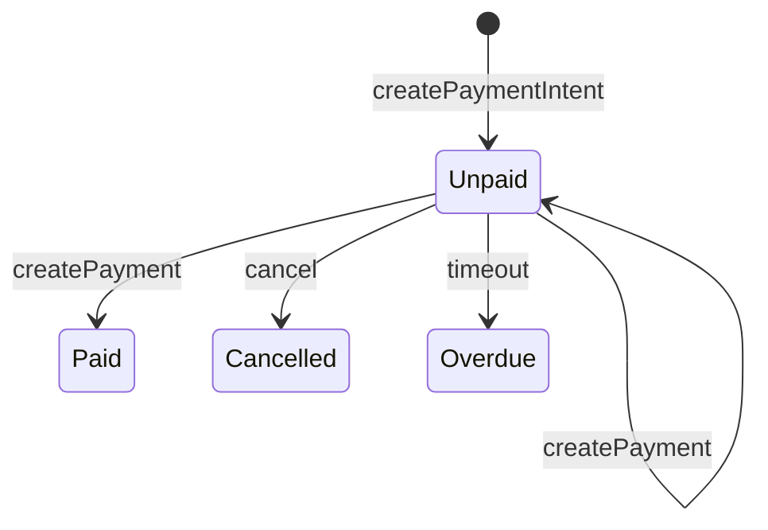
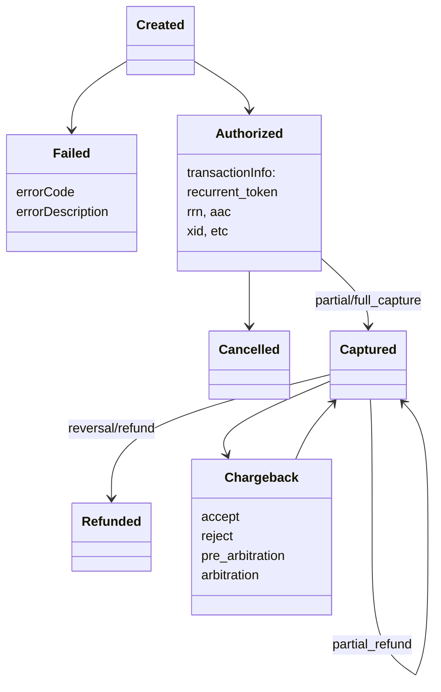
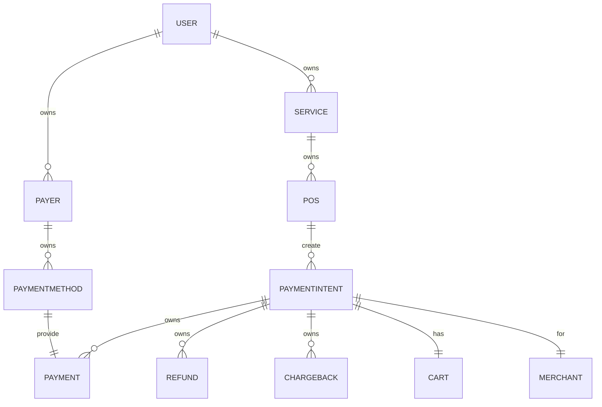
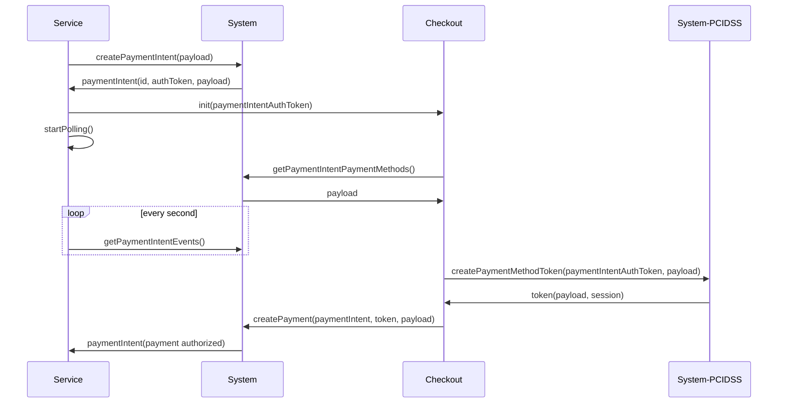
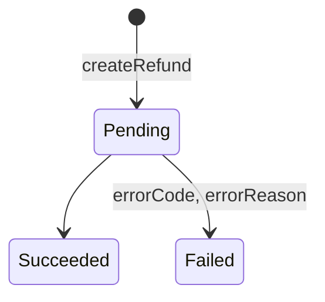

# Платежные потоки

## Payment Intent

- в целом paymentIntent - намерение плательщика оплатить какие-то товары или услуги, предоставляемые мерчантом, то есть сервисом
- paymentIntent-ы выставляются в рамках определенного POS-а мерчанта, это нужно для того, чтобы зафиксировать список условий и ограничений, например какими платежными методами можно оплатить данный paymentIntent, лимиты, проводки и прочее, что было описано в конфиге домена
- также paymentIntent является объединяющей сущностью для сплит-выплат, то есть, когда одно списание с платежного метода плательщика идет расчет с несколькими мерчантами (кейс маркета)
- работает по такому же принципу конечного автомата
- является контейнером для платежей, позволяет объединить несколько платежей, а значит и наборов проводок (например, составной платеж с карты и баллов плюса), либо несколько неуспешных платежей
- успешный платеж (или набор платежей) на сумму paymentIntent-а автоматически переводит его в состояние `paid`
- является идентификатором получения списка событий для внешнего клиента (сервиса, платежной формы), позволяет восстановить текущее состояние объектов для удаленного клиента
- поскольку уникальный ид paymentIntent-а - это ключ, а его значение - это список ивентов, мы всегда можем быстро восстановить любое состояние paymentIntent-а, а также переложить часть ответственности, а значит и нагрузки на клиентов - им достаточно будет хранить у себя ид чтобы восстановить любое состояние из KV хранилища
- ивент сорсинг паттерн событий paymentIntent-а позволяет развязать процессы и сделать из предсказуемыми и параллельными, например сервисы нотификаций, которые смотрят в очереди на поток ивентов определенного типа, например `paymentIntent.created` и рассылают вебхуки, или например сервисы рассылки чеков, которые смотрят на статус `paymentIntent.paid` и пробивают чеки в ККТ поднимая информацию для чека из корзины paymentIntent-а
- если используется система с партициями, то логично сделать балансировку топика `paymentIntents` по партициям в зависимости от ид paymentIntent-а
- у paymentIntent-а должно быть указано четкое время жизни, период в который в нем можно запускать платежи, если это время истечет paymentIntent должен быть переведен системой в финальный статус `overdue`

### Диаграмма переходов



### Корзина товаров и услуг

- именно в paymentIntent-е, а не в платеже наиболее целесообразно держать информацию о корзине, здесь для этого самое место
- таким образом в paymentIntent-е основные сущности - это список товаров или услуг, то есть корзина, сумма и привязка к сервису и POS-у сервиса, который его выставил
- корзина очень хорошо ложится на чеки, достаточно заполнить массив товаров, указать стоимость, количество и налог, чтобы была готовая структура для пробивки чека
- неспецифичная для конкретного чека информация хранится в объектах `user.legal_entity` (например система налогообложения)

```yaml
service
    pos
        paymentIntent[1]
            stock_line
                product: name
                quantity:
                    share:
                        p: 1
                        q: 30
                amount: 100
                measurement_unit: name
        ...
        paymentIntent[n]
    pos2
        paymentIntent[1]
        ...
        paymentIntent[n]

```

```json
{
    "paymentIntent": {
        "amount": 25500,
        "cart": [
            {
                "cost": 25000,
                "price": 25000,
                "product": "Кружка из маркета",
                "quantity": 1,
                "taxMode": {
                    "rate": "20%",
                    "type": "PaymentIntentLineTaxVAT"
                }
            },
            {
                "cost": 500,
                "price": 250,
                "product": "Доставка",
                "quantity": 2,
                "taxMode": {
                    "rate": "20%",
                    "type": "PaymentIntentLineTaxVAT"
                }
            }
        ],
        "createdAt": "2021-06-24T11:55:51.742246Z",
        "currency": "RUB",
        "dueDate": "2021-06-24T12:55:51.488Z",

```

### Let it crash

- здесь особенно сильно нужна реализация `let it crash`, потому что контейнер в котором запускаются бизнес-процессы платежа должен уметь умирать и останавливать движение любых процессов при возникновении нештатной ситуации, например когда мы от провайдера в протоколе получили какую-то дичь, мы должны убить paymentIntent, остановить все транзишены бизнес-процесса платежа и отвечать наружу пятисотками
- нужны интерфейсы по оживлению умерших сущностей, ручному добавлению нужных ивентов и переводу их в нужное состояние

### Payer Interactions

- paymentIntent является контейнером не только для платежей, но и для других сущностей, таких как рефанды, чарджбеки, а главное - события вида `Payer Interactions`
- например нам нужно после взаимодействия с провайдером произвести `3-DS` сессию, или выбрался провайдер СБП НСПК и нам нужно показать плательщику QR-код
- такое состояние можно синхронизировать с внешней стороной (сервисом, чекаутом) добавив в paymentIntent ивент, описывающий шаблон поведения пользователя и передаваемые параметры:

```yaml
paymentIntent
    id: 123
        events:
            id: 2
            eventType: payerInteraction
                payerInteractionType: redirect #[open mobile app etc]
                requestTemplate:
                    uri_template: https://acs.url
                    params:
                        key: TermURL
                        value: https://tem_uri
                        key: PaReq
                        value: pareq
                    requestType: browserPOST
```

```json
[
    {
        "changes": [
            {
                "changeType": "PaymentIntentCreated",
                "paymentIntent": {
                    "amount": 25500,
                    "cart": [
                        {
                            "cost": 25000,
                            "price": 25000,
                            "product": "Кружка из маркета",
                            "quantity": 1,
                            "taxMode": {
                                "rate": "20%",
                                "type": "PaymentIntentLineTaxVAT"
                            }
                        },
                        {
                            "cost": 500,
                            "price": 250,
                            "product": "Доставка",
                            "quantity": 2,
                            "taxMode": {
                                "rate": "20%",
                                "type": "PaymentIntentLineTaxVAT"
                            }
                        }
                    ],
                    "createdAt": "2021-06-24T12:25:06.667607Z",
                    "currency": "RUB",
                    "dueDate": "2021-06-24T13:25:06.219Z",
                    "id": "1UgsXGlvcGW",
                    "metadata": {},
                    "product": "service_order_123456780",
                    "shopID": "TEST",
                    "status": "unpaid"
                }
            }
        ],
        "createdAt": "2021-06-24T12:25:06.673233Z",
        "id": 1
    },
    {
        "changes": [
            {
                "changeType": "PaymentStarted",
                "payment": {
                    "amount": 25500,
                    "createdAt": "2021-06-24T12:25:39.450704Z",
                    "currency": "RUB",
                    "flow": {
                        "heldUntil": "2021-06-25T12:25:39Z",
                        "onHoldExpiration": "cancel",
                        "type": "PaymentFlowHold"
                    },
                    "id": "1",
                    "paymentIntentID": "1UgsXGlvcGW",
                    "makeRecurrent": false,
                    "payer": {
                        "clientInfo": {
                            "fingerprint": "123",
                            "ip": "77.88.17.245"
                        },
                        "contactInfo": {
                            "email": "test@test.com",
                            "phoneNumber": "9876543210"
                        },
                        "payerType": "PaymentResourcePayer",
                        "paymentSession": "eyJjbGllbnRJbmZvIjp7ImZpbmdlcnByaW50IjoiMTIzIiwiaXAiOiI3Ny44OC4xNy4yNDUifSwicGF5bWVudFNlc3Npb24iOiIzdWtrNlBJVkdsSEVNT1p2aEFLbEt5In0",
                        "paymentToolDetails": {
                            "cardNumberMask": "516914******4558",
                            "detailsType": "PaymentToolDetailsBankCard",
                            "first6": "516914",
                            "last4": "4558",
                            "paymentSystem": "mastercard"
                        },
                        "paymentToolToken": "eyJiYW5rX25hbWUiOiJERU5JWkJBTksgQS5TLiIsImJpbiI6IjUxNjkxNCIsImlzX2N2dl9lbXB0eSI6ImZhbHNlIiwiaXNzdWVyX2NvdW50cnkiOiJ0dXIiLCJtYXNrZWRfcGFuIjoiNDU1OCIsIm1ldGFkYXRhIjp7ImNvbS5yYmttb25leS5iaW5iYXNlIjp7InZlcnNpb24iOjN9fSwicGF5bWVudF9zeXN0ZW0iOiJtYXN0ZXJjYXJkIiwidG9rZW4iOiJNZllId1FPYnFjSVlsVVRaRDB2MXkifQ=="
                    },
                    "status": "pending"
                }
            }
        ],
        "createdAt": "2021-06-24T12:25:39.476786Z",
        "id": 2
    },
    {
        "changes": [
            {
                "changeType": "PaymentInteractionRequested",
                "paymentID": "1",
                "userInteraction": {
                    "interactionType": "Redirect",
                    "request": {
                        "form": [
                            {
                                "key": "TermUrl",
                                "template": "https://wrapper.rbk.money/mocketbank/term_url{?termination_uri}"
                            },
                            {
                                "key": "PaReq",
                                "template": "paReq"
                            },
                            {
                                "key": "MD",
                                "template": "COM_MPI-1UgsXGlvcGW.1"
                            }
                        ],
                        "requestType": "BrowserPostRequest",
                        "uriTemplate": "https://3ds-mock.rbkmoney.com/mpi/acs"
                    }
                }
            }
        ],
        "createdAt": "2021-06-24T12:25:40.974173Z",
        "id": 6
    }
]

```

- такую инструкцию можно легко интерпретировать в редирект юзерагента, открытие приложения по хуку на урл и т.п.
- побочный эффект ивентсорсинга в том, что чекаут или сервис может восстановить состояние этой сессии просто проиграв все ивенты и дойдя до `payerInteraction`, таким образом наши интерфейсы стали независимыми от обрывов связи или релоада страницы - после релоада состояние сохранится и тот же 3дс покажется пользователю снова

### Авторизация вызовов

- модель позволяет сделать прозрачную для сервиса авторизацию вызовов, позволяющую отдать авторизационный токен прямо на клиента (paymentIntentAuthToken)
    - нюансы авторизации - JWT, как развязанная система
    - скоупы по аналогии с гитхабовскими
    - пример JWT paymentIntent-а:
```yaml
paymentIntentAuthToken
    sig: ...
    exp: 2021-07-10
    resource
        api-gw
            roles
                paymentIntents.{INVOICE_ID}:read
                paymentIntents.{INVOICE_ID}.payments:read
                paymentIntents.{INVOICE_ID}.payments:write
                payment_methods:write
```
- такая же модель авторизации подходит для любых сущностей, которые мы отдаем на внешние интерфейсы, например можем сделать `accountAuthToken` чтобы показывать баланс `payer`-а прямо из учетной системы в вебе
- в целом модель авторизации и аутентификации на связке `JWT` и `scope` позволяет описать ролевую модель доступа не только к динамическим сущностям, но и к управлению системой - портянка ролей может быть очень большой и описывать все доступы
- к примеру скоуп на `suspend` юзера может быть у сервиса, но скоуп на `activate` - уже у администратора системы
- система управления ролями неплохо визуализируется в админке
- да, там есть проблема с отзывом токенов и ее нужно будет решить
- чем еще хорош JWT, простой подменой токена можно сделать `impersonate`, добавив свои роли и авторизовавшись на апи гейтвеях уже с раширенными правами

## Платеж

- платежи запускаются в рамках ранее созданного paymentIntent-а, соответственно обязательно нужен его ид
- для запуска самого платежа нужны данные платежного метода плательщика, это могут быть как сущности, не требующие знать идентификатор плательщика, например карты или любые другие платежи
- или данные внутренних платежных методов, таких как номер кошелька плательщика внутри системы (например, с баллами бейджа или плюса, пополненным счетом директа и пр), нам как финансовой системе не обязательно авторизовать пользователей, это задача сервиса
- время жизни платежа настраивается отдельным параметром и как правило должно составлять от 1 до 20 минут, после истечения этого срока система должна перевести платеж в статус `failed` и в paymentIntent-е можно будет запускать следующие попытки оплаты

### Диаграмма переходов



#### Дополнительные события платежа

- нам нужно синхронизироваться по состояниям с внешними системами, классический кейс - это пробивка чеков в ОФД
- несмотря на то, что пробивка чека скорее не должна менять статус платежа, нам нужно уметь добавлять это состояние в его автомат и на этом строить мониторинг и выборки сверок "чек отправлен/не отправлен", а также отдавать сервисам дополнительный пейлоад, например такой как номер смены или номер фискального документа, это может понадобиться в их внутренних бизнес-процессах

```yaml
payment
    events
        captured
        cashreg_event
            cashreg_receipt_fixed
                cashreg_payload
                    fiscal_number: 123
                    ofd_external_id: 1234

```

## Собираем вместе



### Токенизация платежных методов

- для минимизации мест хранения карточных данных и токенов прямого управления платежными методами используется токенизация любых платежных методов (в том числе токенизированных)
- фактически это отдельная ручка, которая находится в зоне PCI-DSS, принимает на вход карту или любой другой метод, шифрует, сохраняет и генерирует случайный ключ, `paymentMethodToken` который отдается наружу
- помимо самого ключа платежного метода стандарт на нас накладывает обязанность хранить CVV только на время жизни платежной сессии, для этого рядом с токеном платежного метода нужно использовать токен платежной сессии, `paymentSessionToken` который является таким же ключом, но содержит в себе CVV, система должна автоматически затирать эти данные после получения авторизации платежа, перехода в финальный ошибочный статус или по таймауту жизни платежа
- дополнительная авторизация
    - платежный токен можно использовать как метод контроля пользовательских запросов, например ограничив количество попыток платежа с одним токеном
    - в платежном токене должна быть зашита информация об paymentIntent-е, с которым он был создан, таким образом токенизированные данные одного плательщика нельзя будет украсть и использовать для оплаты чужих товаров и услуг
- защита от выстрела себе в ногу: поскольку метод токенизации отдается на клиента, то есть попадает в полностью недоверенную среду, авторизация этого метода должна осуществляться исключительно с помощью `paymentIntentAuthToken`, а попытка использовать бекендовый ключ авторизации должна приводить к ошибке `401` и детальной расшифровке текстом
- побочный эффект токенизации - это возможность сервисам верстать свои собственные платежные формы - данные держателей карт обрабатываются только в UA плательщика и уходят на наш сервер, откуда возвращается наш токен
- простой сиквенс успешного кейса простого платежа



### Рефанды

- в каждом платеже может быть запущен рефанд на сумму от минимальной до суммы платежа
- каждый рефанд - это такой же ивент в нашей модели, который дополняет и изменяет состояние конечного автомата платежа
- в принципе, рефанд похож на платеж, у него тоже есть свой набор состояний (потому что рефанд - это комплексная операция, требующая взаимодействия с 3 стороной)

#### Диаграмма переходов



```yaml
paymentIntent
    id: 111
    events
        paymentCreated: payload
            refundCreated:
                id: 1
                amount: 100
            refundSucceded:
                id: 1
                payment_id: 1
```

#### Расчетные единицы

- для удобства расчетов все значения сумм используем в виде минимальных денежных единиц - копеек, центов и прочего
- при дробных операциях в конфиге домена указываем правила округления, `rounding_policy`
- непокрытой остается тема суммы paymentIntent-а, в идеальном мире нам нужно знать необходимую сумму paymentIntent-а до запуска в нем платежей с тем, чтобы иметь критерии перевода paymentIntent-а в состояние `paid`

#### Корректирующие проводки

- ошибки неизбежны, поэтому система должна предоставлять интерфейс приведения платежей к новым условиям
- технически корректирующая проводка, `adjustmentEntry`, реализацией похода на рефанд - это еще один ивент в автомате платежа, который изменяет изначальные условия
- механизм действия простой и решается версионной моделью работы конфига домена - в конфиге прописываются новые условия, в системе вызывается метод `createAdjustmentEntry(paymentIntent.payment, domain.revision)`, ядро производит пересчет проводок по новой модели и добавляет это ивентом в платеж
- сервисы, проводящие фоновые бизнес-функции, например такие как сервисы выплат или статистики должны учитывать в потоке подобные ивенты и иметь бизнес-логику их применения (например сервис выплат должен пересчитать сумму итоговой выплаты с учетом пришедших событий о корректировках и учесть их вы будущих периодах выплат в строках корректировок)

## Выплаты, отчеты и реестры

### Событийная модель и очереди

- платежный поток по ивент сорсинговой модели хорошо ложится на сервисы распределенного WAL, такие как Кафка, в таком случае мы можем развязать процессы работы ядра, где хайлоад и процессы бэкофиса
- поэтому ту часть, что находится перед очередью можно условно называть онлайн частью, а ту, что за очередью - бэкофисной
- по опыту, восстановить состояние системы `emerge world` можно храня события в очереди без ретеншенов, это достаточно надежное и производительное место хранения, обычно пеереналивать состояние всей системы с начала времен не нужно, а вот перелить какой-то сервис типа статистики в ЛК сервиса - довольно часто
- производительность очереди как правило сильно превышает количество продюсеров

### Выплаты

- за очередью стоят консьюмеры сервисов, задача которых генерить выплаты
- фактически выплата это агрегат по счету за определенный период, в нашем случае - по счету мерчанта
- входящими параметрами для выплат могут быть `service.pos` или `merchant.settlement` счета
- сервис выплат мониторит поток событий платежей и фильтрует их только по нужным ему состояниям, в частности `payment.captured`, `payment.refund.succeeded`, `payment.adjustment.created` и складывает их в локальную табличку своей базы - то есть это тот сервис, который хранит свое состояние
- периодически на сервисе запускается джоб, который чекаутит конфигурацию домена, пробегается по сущностям у которых привязано расписание `BusinessSchedule`, чекаутит себе `NationalHolidayCalendar` и понимает за какой период ему надо сгенерить выплату (например предыдуший рабочий день или за последние 3 дня учитывая 2 выходных и праздник)
- считает данные по нужному посу или мерчанту за нужный период, холдирует сумму на счете поса или мерчанта `settelement` - таким образом если запустится второй сервис выплат, он уже не сможет задублировать списания
- создает ивент `payout.created`, который доходит до адаптеров выплат и превращается там в межбанковский платеж
- после подтверждения платежа выплата переводится в статус `succeeded` и перевод со счета `merchant.settlement` на счет `merchant.payout` коммитится
- опционально на операцию `payout` можно указать план проводок, например для расчета комиссии за вывод или удержания налогов

### Отчеты, реестры

- в целом логика работы сервисов отчетности повторяет модель выплатных сервисов, кроме того, что они не производят движения средств по счетам
- онлайн отчетность в ЛК - это реляционная вещь, если учесть, что ядро у нас построено на KV, поискать по индексу там не получится, поэтому нужны РСУБД типа постгреса, реализация всего этого - простая техника
- генерация реестров и сверок может занимать большие ресурсы, поэтому внешний интерфейс должен быть асинхронным, с будущей отдачей ссылки на скачивание файла с файлопомойки типа S3

### Сверки и клиринг

- мы можем работать по разным моделям, как правило екомм - это пуш модель, когда нам по итогам принятых платежей приходят реестры и мы по ним сверяемся
- однако мы можем работать по хостовому протоколу и в таком случае генерация файла `клиринга` ложится на нас и уже по этому файлу эквайер перечисляет нам возмещение
- дабы не плодить лишние сущности можно остановиться на одном статусе платежа - `cleared`, обозначающем как попадание его в клиринг, так и сверку по внешним реестрам
- сервисы бэкофиса, отвечающие за генерацию выплат в идеальном случае должны смотреть как раз на этот статус, чтобы минимизировать расхождения по выплатам, но это тащит за собой целый пласт проблем расхождения сверки и задержки выплат, этот бизнес-процесс надо прорабатывать совсем отдельно и детально

### Бэкофис

- все сервисы бэкофиса работают так или иначе по схеме обработки ивентов с фильтрацией по типам, обычно складывая их в свои локальные хранилища и предоставляя ручки выборки или реализацию бизнес-процессов, например 

## Финал

- на этом этапе у нас появились сущности, которые позволяют связать конфигурацию и участников сделок и провести непосредственно процессы проведения платежей и движения денег
- в целом в этой модели описана универсальная финансовая система, позволяющая с нюансами реализации закрыть многие потребности, дело как всегда в нюансах
- следующая тема - карта логической связи микросервисов
