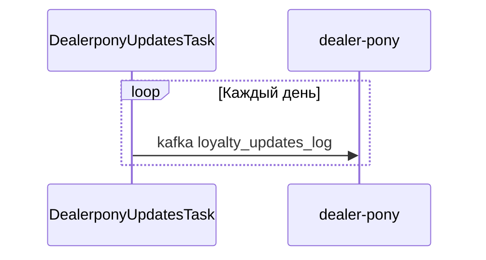
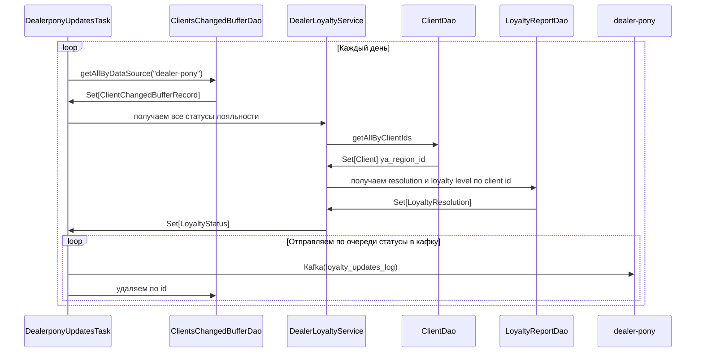
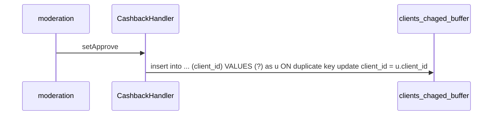
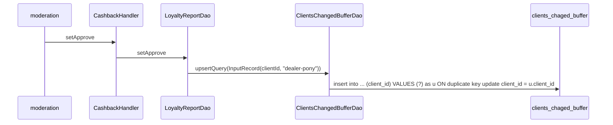

# Содержание

1. [Dealer Telepony](#dealer-telepony)
2. [Telepony Info](#telepony-info)

# Dealer Telepony

Сервис, добавляющий телефонные номера дилеров в белые списки (БС) telepony. Подробнее мотивация и требования описаны [здесь](https://st.yandex-team.ru/VSDEALERSDECOMP-210)

## Что делает этот сервис

Сервис позволяет лояльным дилерам отправлять номера своих телефонов в белые списки telepony, чтобы тот их не банил. 

Для этого он трекает дилеров на предмет лояльности, читая сообщения об их лояльности от salesman [см. этот тикет](https://st.yandex-team.ru/VSDEALERSDECOMP-240), а также хранит свой список исключений: привилегированных дилеров.

Для всех дилеров сервис хранит список их номеров, которые дилер может добавить, вычитать и удалить. У каждого дилера есть метка времени, до какого момента его номера активны в БС (может быть NULL, если номера еще не попадали в БС). Каждый дилер может добавит не более определенного количества номеров (сейчас лимит — 200).

- Номера лояльных дилеров нужно отправлять в белые списки сервиса telepony с помощью [запроса](http://telepony-api-int.vrts-slb.test.vertis.yandex.net/swagger/?url=/api/2.x/#!/shared32whitelist/addRoute_1)

- При удалении дилером номеров, помечаем их `to_be_deleted`, в отдельном таске удаляем из базы и [telepony](http://telepony-api-int.vrts-slb.test.vertis.yandex.net/swagger/?url=/api/2.x/#!/shared32blacklist/deleteRoute).

- При добавлении номеров лояльного дилера, они записываются в таблицу номеров, позже таск запушит их в telepony.

- При изменении статуса дилера с "лояльный" на "нелояльный" помечаем все его номера `to_be_deleted`, позже специальный таск удалит их из telepony и из базы.

## Как это работает

Таблица лояльности дилеров:

    CREATE TABLE dealers_status(
        dealer_id BIGINT PRIMARY KEY,
        updated_at timestamptz NOT NULL,
        loyalty_level INTEGER NOT NULL,
        region_id INTEGER NOT NULL,
        has_full_stock BOOLEAN NOT NULL,
        wl_available BOOLEAN NOT NULL
    )
    
`wl_available` — доступность белых списков дилеру, вычисляется на основе данных о загруженности склада `has_full_stock`, уровня лояльности `loyalty_level` и региона по правилу: `has_full_stock` = TRUE, `loyalty_level` >= 12 месяцев для столиц, `loyalty_level` >= 6 месяцев для остальных.

Таблица привилегированных дилеров (всегда лояльны):

    CREATE TABLE dealers_privileged(
        dealer_id BIGINT PRIMARY KEY,
        comment TEXT
    )

Таблица TTL номеров дилера:

    CREATE TABLE dealers_deadlines(
        dealer_id BIGINT PRIMARY KEY,
        expiration_date TIMESTAMPTZ
    )
   
`expiration_date` — метка времени, указывающая, когда телефонные номера дилера в telepony будут автоматически удалены из белого списка.
   
Таблица номеров дилеров и счетчиков количества номеров:

    CREATE TABLE dealers_phone_numbers(
        dealer_id BIGINT NOT NULL,
        phone VARCHAR(12) NOT NULL UNIQUE,
        to_be_deleted BOOLEAN NOT NULL DEFAULT FALSE
    )

    CREATE TABLE dealers_phone_counters(
        dealer_id BIGINT PRIMARY KEY,
        counter INT NOT NULL CHECK (counter >= 0)
    )
    
`to_be_deleted` — флаг, указывающий, что номер стоит в очереди на удаление.

## Трекинг статуса лояльности дилеров.

### Consumer сообщений о лояльности дилеров

вычитывает сообщения о лояльности из кафки (loyalty-updates-log) от salesman, обновляя статус доступности белых списков, загруженность склада, уровень лояльности, регион и флаг лояльности в таблице `dealers_status`.

### Task для добавления и удаления номеров в telepony

Таск делает три вещи:

1. маркирует все номера нелояльных дилеров как `to_be_deleted`

2. посылает в telepony с TTL = 3мес номера лояльных/привилегированных дилеров, чей expiration_date скоро наступит (уже наступил, is NULL) и `to_be_deleted = FALSE`, в случае успеха — обновляет `expiration_date` напротив дилера

3. удаляет из telepony номера, находящиеся в очереди на удаление (`to_be_deleted = TRUE`), и — в случае успеха — удаляет их из базы.

### Добавление дилеров в список привилегированных дилеров

Данный механизм позволяет дать доступ к белым спискам для заданных дилеров вне зависимости от их статуса лояльности.

Добавление дилеров в список привилегированных осуществляется через добавление соответствующих записей в словарик в пальме: [prod](https://palma.vertis.yandex-team.ru/dictionaries/auto/dealer-pony/loyal-dealers), [test](https://palma.test.vertis.yandex-team.ru/dictionaries/auto/dealer-pony/loyal-dealers)

## API для работы с номерами дилеров.

GRPC api для заполнения дилерами таблицы `dealers_phone_numbers` с номерами их телефонов.

Ручки GRPC и логика их работы:

### AddPhoneNumbers(dealer_id: Long, phones: List[phone])

если функция белых списков доступна для дилера (ID в списке привилегированных дилеров `dealers_privileged` (в приоритете) или `wl_available = TRUE` в `dealers_status`) можем записать в дао все номера из запроса ( DealerPhonesDao.entriesLeftForDealer(dealer) >= phones.length ), пишем номера ( DealerPhonesDao.insert ), при ошибке записи выставляем ошибку напротив конкретного номера в Response. В противном случае возвращаем FAILED_PRECONDITION

### DeletePhoneNumbersRequest(dealer_id: Long, phones: List[phone])

если функция белых списков доступна для дилера, маркируем номера как требующие удаления ( DealerPhonesDao.markToBeDeleted ). Ошибки — по аналогии с AddPhoneNumbers

### ListPhoneNumbers(dealer_id: Long)

если функция белых списков доступна для дилера, возвращаем список его номеров ( DealerPhonesDao.get ). В противном случае возвращаем FAILED_PRECONDITION

### WhiteListAvailable(dealer_id: Long)

возвращает информацию о доступности БС для дилера, флаг `wl_available` в `dealers_status` или присутствие `dealer_id` в `dealers_privileged` (если информации о дилере нет в таблицах — false)

### PhoneEntriesLeft(dealer_id: Long)

сколько еще номеров можно записать для дилера (limit минус количество записанных номеров с `to_be_deleted = FALSE`)

## Генерация сообщений об изменении лояльности в salesman

Сообщения для топика loyalty-updates-log в кафке создаются на стороне saleseman
с помощью таски DealerponyUpdatesTask.

После получения списка клиентов с изменившейся лояльностью, нужно получить из таблиц:
*  salesman.loyalty_resolution:
    - статус лояльности - resolution
    - уровень лояльности - loyalty_level
    - заполненность складов - has_full_stock
* office7.client:
    - регион клиента - ya_region_id

После отправки сообщения в кафку нужно удалять из буферной таблицы запись об отправленном клиенте
для dealer-pony источника.

Более подробная схема

Обновление буферной таблицы происходит после одобрения лояльности и после закрытия периода кэшбэка.

Сохранение изменения при одобрении статуса лояльности

Сохранение изменения при закрытии периода кэшбэка

## Описание проекта
Сервис для создания белых списков для дилеров

### Ссылка на описание grpc сервиса в schema-registry
???

### Сcылка на тимсити
[api](https://nda.ya.ru/t/x75jGk2Z3uDz72)

[scheduler](https://nda.ya.ru/t/O8SmlZT63wKikT)

### Метрики
???

### Алерты
verticals-autoru-dealers-monitoring тг

### Где смотреть логи
[графана тест](https://nda.ya.ru/t/Yy_05BzQ3uDzQK)

### PostgreSQL clusters

[prod](https://nda.ya.ru/t/0waHD-M33wLCrE)

[test](https://nda.ya.ru/t/as7JYQZB3wLCoD)

### Sentry
[sentry](https://sentry.vertis.yandex.net/settings/verticals/projects/dealer-pony-api/)

### Secrets

[postgres-prod](https://nda.ya.ru/t/lk4iKAS03wKiVY)

[postgres-test](https://nda.ya.ru/t/8ITRxYxS3wKhom)

# Telepony Info

Сервис для генерации квалифаеров по офферам для дилеров. Нужен для получения некоторой метаинформации, которая необходима для получения подменника в telepony.
Телепони выдает на разные квалифаеры разные подменники(в том числе и одному дилеру), поэтому тут мы парсим категорию оффера, секцию и необходимость в calltracking-е.
## Состоит из 3 ручек:
1. ### getTeleponyInfoByOffer
   Ручка для генерации квалифаеров по офферу.
2. ### getTeleponyInfoBatch
   Батчевая ручка для генерации квалифаеров. На вход получает список реквестов либо с офферами, либо с offerData. В отличие от обычной ручки - при генерации квалифаера учитывает также платформу размещения(Avito/Autoru...).
   Response состоит из пришедших запросов + ответов на них. Также стоит заметить, что батчевая ручка обрабатывает запросы только для одного clientId.
3. ### callInfo
   Возращает id клиента и оффера звонка.

Сервис зависит только от кабинета, так как туда мы ходим за данными по клиенту.

Квалифаеры генерируются на отдельный оффер для дилеров, которые хотят трекать звонки OR находятся в челябинске и свердловске(какой-то эксперимент) OR находятся в платных регионах - мск и Питер.
Также квалифаеры выдаются только на машины (category = cars).
