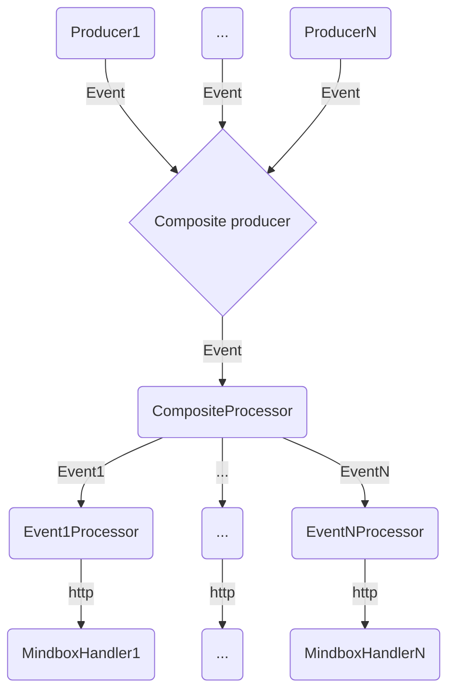

# Брокер событий центра уведомлений[WIP]

## Что это
Сервис для вычитывания событий сервиса, важных для отправки пушей и отправки их в mindbox.

Примерная схема работы сервиса:

### Проект в стадии запуска, отправка событий в mindbox пока не реализована
