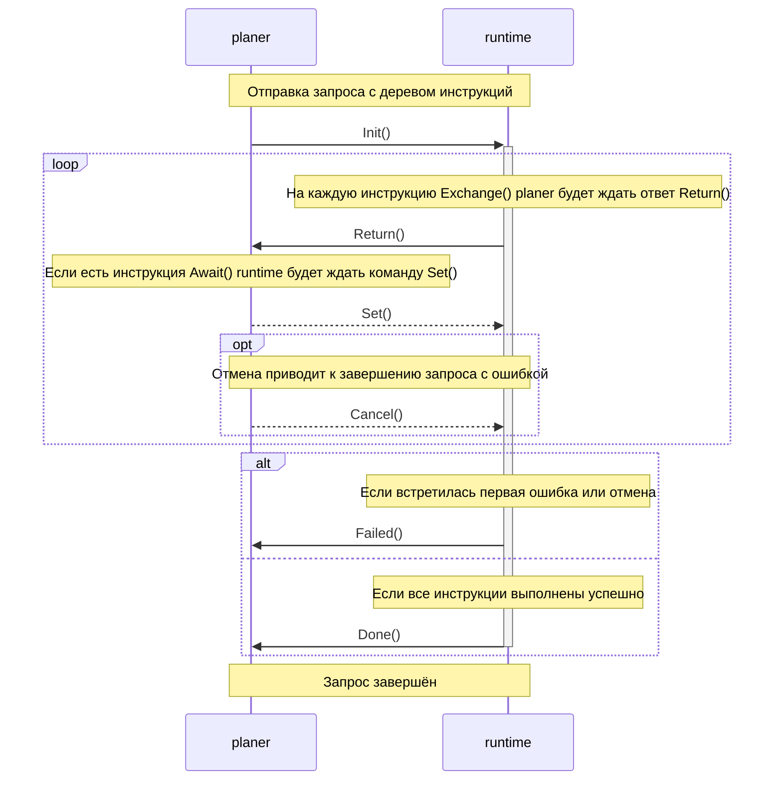

# Протокол

> sp(l)ice must flow!

### Запрос ```run(stream RunRequest) returns (stream RunResponse)```


```mermaid
sequenceDiagram
  participant planer
  participant runtime
  Note over planer, runtime: Отправка запроса с деревом инструкций
  planer->>+runtime: Init()
  loop
    Note over runtime: На каждую инструкцию Exchange() planer будет ждать ответ Return()
    runtime->>planer: Return()
    Note over planer: Если есть инструкция Await() runtime будет ждать команду Set()
    planer-->>runtime: Set()
    opt
      Note over planer, runtime: Отмена приводит к завершению запроса с ошибкой
      planer-->>runtime: Cancel()
    end
  end
  alt
    Note over runtime: Если встретилась первая ошибка или отмена
    runtime->>planer: Failed()
  else
    Note over runtime: Если все инструкции выполнены успешно
    runtime->>-planer: Done()
  end
  Note over planer, runtime: Запрос завершён
```