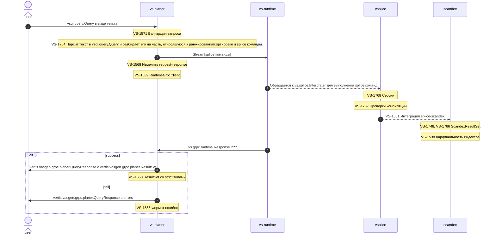

## VS: алгоритм работы

### Non-realtime part

<span style="color:red">TODO описать ... </span>

#### vs-indexer

1. Забирает документы из registry очереди
2. Раз в N минут сериализует базу и записывает ее в s3. Куда именно - см.[тут](/docs/decisions/0001-s3-format_doc.md#принятое-решение)

### Realtime part

#### vs-planer

Имеет grpc api, принимающее на вход текст [vsql](/docs/vs/vsql/lang.md) запроса. Если в запросе обнаружится
синтаксисическая ошибка, то ее человекочитаемое описание попадет в `errors` поле.

⚠️ Пока поддерживается единственный тип запроса:

```sql
SELECT *
FROM auto
WHERE PK = ???
```

На выходе - структура по типу таблицы, где в поле `columns` описывается порядок следования полей и их типы (последнее
только для визуальной оценки, для декодирования не нужны), в поле `rows` - значения соответствующих колонок в байтовом
представлении; количество элементов в поле `rows` равно количеству колонок * количество строк, т.е. плоское
представление матрицы. Для кодирования значений используется `strict.types.container.Container` -
контейнер `strict.types.StrictValue` значений, т.к. пока невозможно отличить мульти-индексы от обычных индексов.

**vs-planer** обращается за ответом к единственному **vs-runtime**.

##### Пример

```sh
grpcurl --plaintext -d '{"vs_query": "SELECT * from auto WHERE PK=78"}' vs-planer-grpc.vrts-slb.test.vertis.yandex.net:80 vertis.vs.grpc.Planer/ExecuteQuery
{
  "table": {
    "columns": [
      {
        "name": "some numbers",
        "primitiveType": "INT32"
      },
      {
        "name": "animals",
        "primitiveType": "UTF_8"
      },
      {
        "name": "content",
        "primitiveType": "BYTES"
      },
      {
        "name": "PK",
        "primitiveType": "INT32"
      }
    ],
    "rows": [
      "CgQaAghO",
      "CgyyAQkKB2dpcmFmZmU=",
      "",
      "CgQaAghO"
    ]
  }
}
```

##### <span style="color:red">TODO агрегация и ранжирование ответов различных vs-runtime </span>

#### vs-runtime

Следит за изменениями базы данных, записанной в [s3](/docs/decisions/0001-s3-format_doc.md#принятое-решение). Смотрит строго ту **эпоху**, что
была указана в env переменных при запуске сервиса.

Для стратегии `WATCH_DB_FORMAT_ONE_FILE` имя файла значение не имеет, при запуске vs-runtime привязывается к последнему
измененному файлу.

**vs-runtime** раз в `WATCH_TIMEOUT` проверяет дату последнего изменения файла и скачивает более свежую версию базы,
если она есть.

#### Схема взаимодействия realtime части




