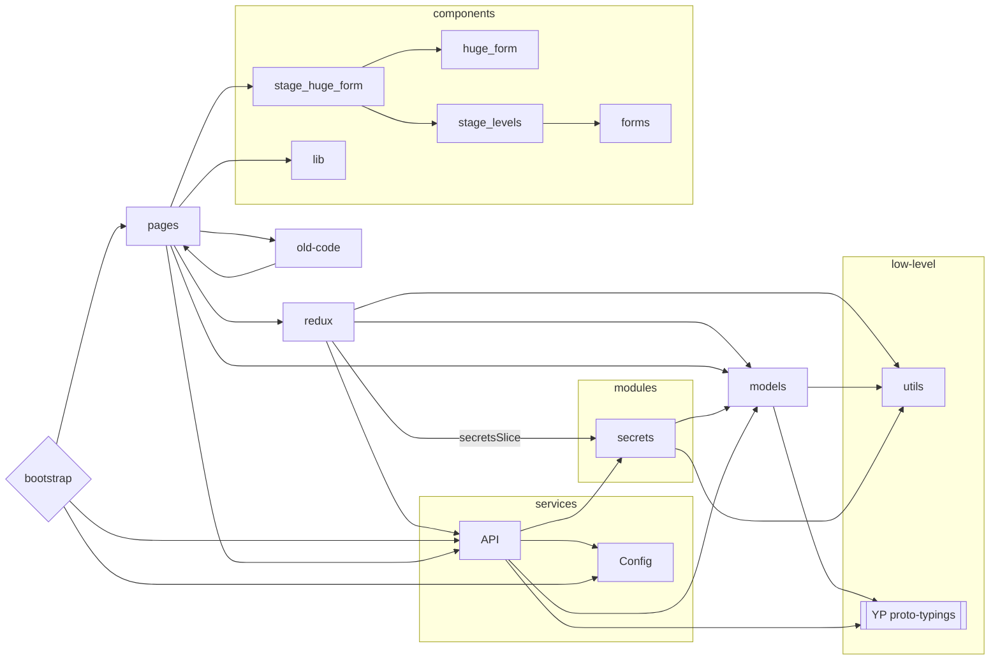

# Yandex Deploy Web UI

# Установка

# Настройка окружения

# Запуск

# Диаграмма зависимостей

```mermaid
graph LR
    B{bootstrap}
    P[pages]
    M[models]
    R[redux]
    O[old-code]

    subgraph modules
        S[secrets]
    end

    subgraph services
        A[API]
        Cfg[Config]

        A --> Cfg
    end

    subgraph C[components]
        F[forms]
        SHF[stage_huge_form]
        HF[huge_form]
        SL[stage_levels]
        L[lib]

        SHF --> HF
        SHF --> SL
        SL --> F
    end

    subgraph low-level
        U[utils]
        Y[[YP proto-typings]]
    end

    R -->|secretsSlice| S
    R --> M
    R --> U
    R --> A

    B --> P
    B --> A
    B --> Cfg

    P --> M
    P --> A
    P --> R
    P --> SHF
    P --> L

    M --> U
    M --> Y

    S --> M
    S --> U

    A --> M
    A --> S
    A --> Y

    O --> P
    P --> O
```
