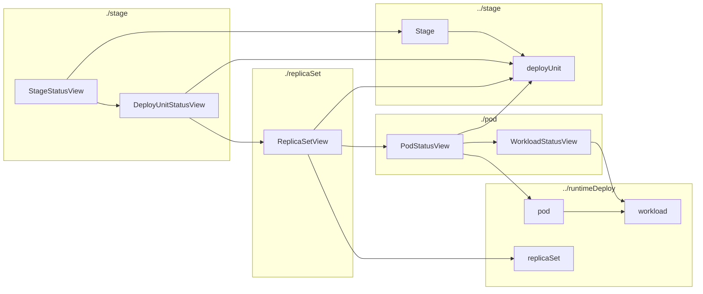

# Модель статусов

Здесь все специфичные вещи, которые относятся к странице статуса.
Они переиспользуют модели объектов YP (поды, реплика-сеты, стейджи), но добавляют сверху свою логику.

Практически все они нужны, чтобы заметать под ковёр несовершенство бекенда.

Среди кейсов:
- перезапись полей для сокрытия багов
- перерасчёт данных для согласования вида объектов (на 11 января 2022 пересчёт статусов реплика-сетов опаздывает на 15 секунд, деплой-юнитов — на 40 секунд)

## Соглашение по именованию
Имена основных сущностей получаются склеиванием имени сущности YP и суффикса `StatusView`

Например:
`Pod` > `PodStatusView`

`ReplicaSet` > `ReplicaSetStatusView`

## Дерево зависимостей

по папкам

