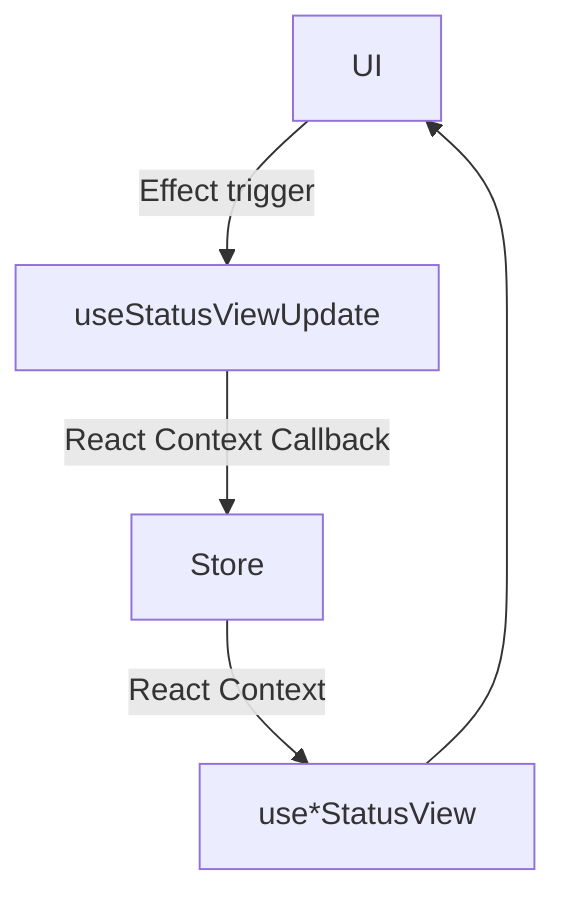
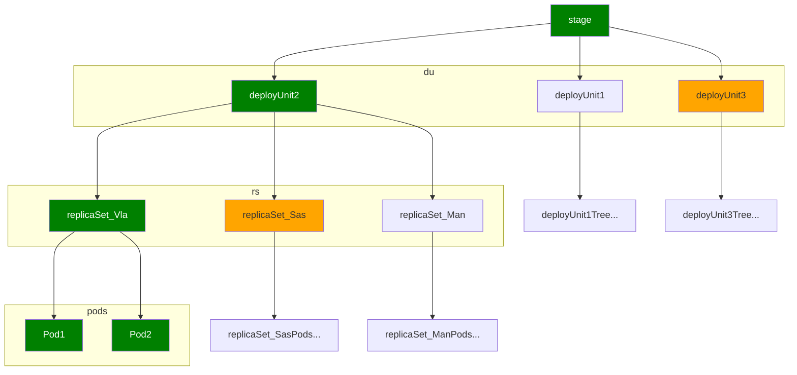

## Настройки пересчёта
Чтобы увидеть скрытые настройки, нужно выставить флаг `status-view-settings-visible` в localStorage.
```javascript
localStorage.setItem('status-view-settings-visible', true);
```

## Схема хранения StatusView моделей


## useStatusViewUpdate
Процесс обновления дерева
Зеленые узлы — активная часть дерева
Оранжевые узлы — расчитывались в предыдущие разы
Остальные не расчитывались

В рамки сгруппированны узлы, видимые на странице (например DeployUnit1 хоть и не выбран, но присутствует в общем списке)


Процесс вычисления и сохранения моделей
1. Взять из redux данные для объектов в рамках (данные стейджа, всех деплой-юнитов, всех реплика-сетов для активного юнита и все поды в активной локации для юнита)
1. Вычисления снизу вверх, сначала поды, потом rs, потом du, потом стейдж
1. Для зелёных объектов брать данные из redux
1. Для оранжевых объектов смотреть время последнего обновления - если меньше ttl, брать кэш из контекста, если больше, стирать данные из контекста и брать пустые массивы
1. Для остальных объектов брать пустые массивы
1. Все вычисленные объекты записать в контекст

Таким образом покрываются все текущие сценарии — то есть все объекты на странице получают свою StatusView модель. Если изменится вёрстка — например будут видны все реплика-сеты в дереве с деплой-юнитами, то необходимо будет обработать большую часть дерева, в данном случае рассчитать все реплика-сеты у всех деплой-юнитов, но для этого нужны изменения и в redux части, ведь rs надо сначала скачать по сети.
