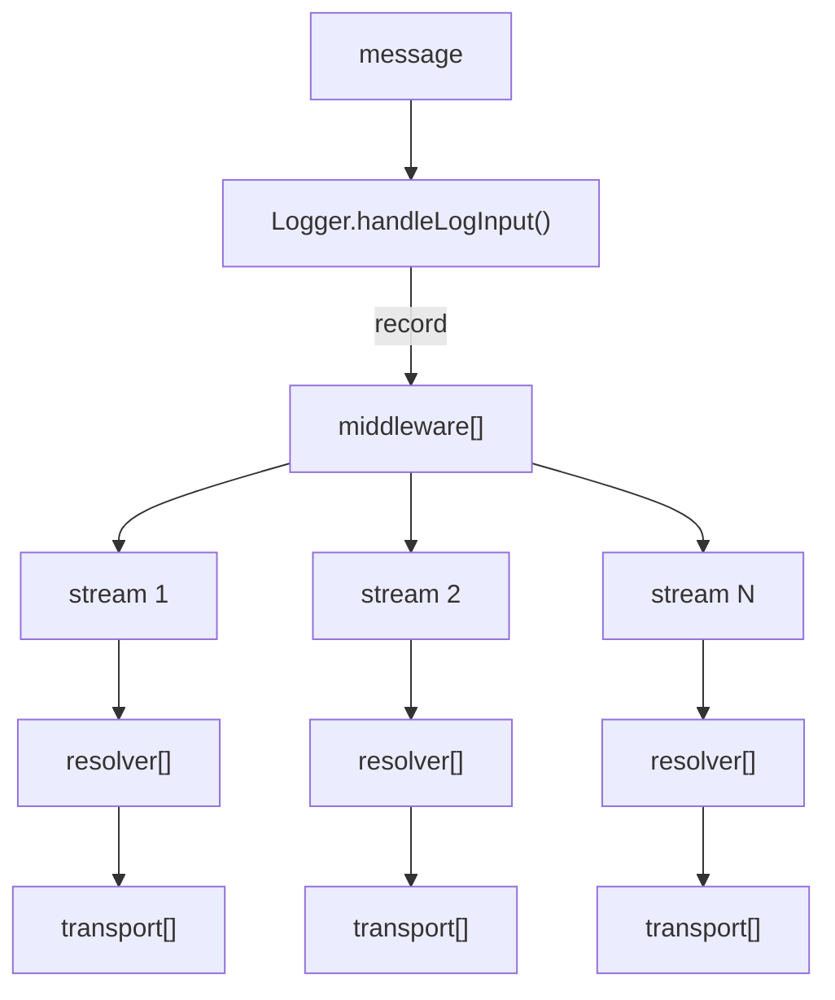

# logger

## Быстрый старт

```ts
import {
    createStream,
    errorResolver,
    Logger,
    requestResolver,
    securePassportCookie,
    secureTvmHeaders,
    stringifyTskv,
    syslogWriter,
    taxiFormatter,
    TaxiKibanaMeta,
    Transport
} from '@lavka-js-toolbox/util';

const writer = syslogWriter({ident: 'my_app'});
const formatter = taxiFormatter();
const transport: Transport = (report) => writer(stringifyTskv(formatter(report)));
const logger = new Logger<TaxiKibanaMeta>({
    name: 'my_app',
    middleware: [securePassportCookie(), secureTvmHeaders()],
    commonMeta: {version: '0.0.0', env: 'development'},
    stream: createStream({level: 'debug', transport, resolver: [errorResolver, requestResolver]})
});

logger.info('Hello!');

logger.error(new Error());
```

## Схема работы




Отправить в лог можно любой тип сообщения.

Когда сообщение отправляется в лог оно попадает в метод `Logger.handleLogInput()`, который преобразует сообщение в
объект `record` (1).

Далее сообщение проходит по **общей** `middleware` цепочке и затем отправляется в потоки (streams).

Для **каждого** потока, сообщение проходит через `resolver`-ы (2).

Затем сообщение передается всем объявленным в потоке `transport`-ам (3). Транспорт получает `record` объект и может
использовать вспомогательные `formatter`-ы (4), `writer`-ы (5) и `stringify` (6) методы.

Определения:

1. `record` это объект с произвольными свойствами, который получается из входящего в лог сообщения.

2. `resolver` предназначен для обогащения свойств сообщения (например, `errorResolver` добавляет
   свойства `error_message`, `error_code` и `error_stack`).

3. `transport` это конечная точка логирования, здесь сообщение должно быть отформатировано и записано.

4. `formatter` преобразует `record` поля (например, отбрасывает лишние поля, или изменяет поле `timestamp`).

5. `writer` записывает отформатированное сообщение.

6. `stringify` преобразует `record` в строку.
