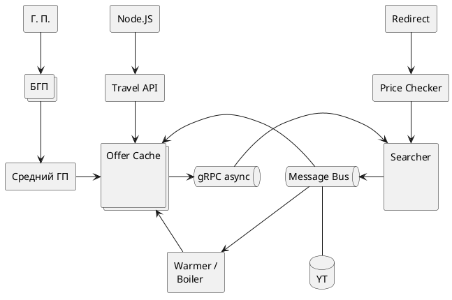
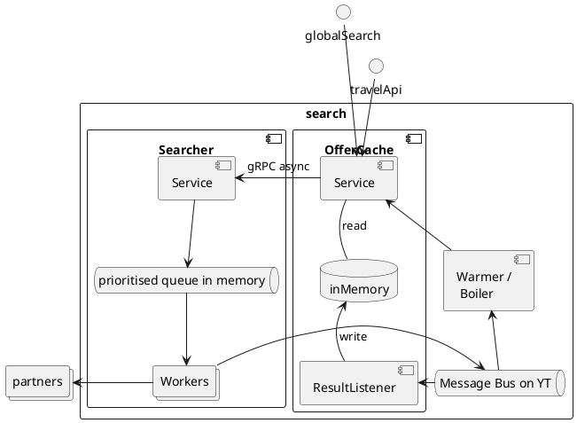

# Черновик. Архитектура Поиска Предложений Бронирования Номеров в Отелях

#### Картинка

@startuml

agent gp as "Г. П."
collections bgp as "БГП"
agent middle_gp as "Средний ГП"
collections offer_cache as "Offer Cache\n\n\n"
agent searcher as "Searcher\n\n\n"
agent boiler as "Warmer /\n Boiler"
queue offer_cache2searcher as "gRPC async"
queue searcher2offer_cache as "Message Bus"
database searcher2offer_cache_yt as "YT"
agent travel_api as "Travel API"
agent travel_front as "Node.JS"

agent redirect as "Redirect"
agent price_checker as "Price Checker"

redirect -down-> price_checker
price_checker -down-> searcher

gp -down-> bgp
bgp -down-> middle_gp
middle_gp -right-> offer_cache

offer_cache -right-> offer_cache2searcher
offer_cache2searcher -right-> searcher
searcher -left-> searcher2offer_cache
searcher2offer_cache -left-> offer_cache

searcher2offer_cache -> boiler
boiler -up-> offer_cache
travel_api -down-> offer_cache
travel_front -down-> travel_api
searcher2offer_cache_yt -up- searcher2offer_cache

@enduml

### структура поиска вариантов бронирования:

#### Картинка
@startuml
!pragma layout smetana
!pragma horizontalLineBetweenDifferentPackageAllowed
rectangle search {
    component offerCache as "OfferCache" {
        component offerCacheService as "Service"
        database inMemory
        component offerCacheResultListener as "ResultListener"
        offerCacheService -down- inMemory : read
        offerCacheResultListener -up-> inMemory : write
    }

    queue searcher2offerCache as "Message Bus on YT"
    component boiler as "Warmer /\n Boiler"

    component searcher as "Searcher" {
        component searcherService as "Service"
        queue searcherInMemory as "prioritised queue in memory"
        collections searcherWorkers as "Workers"
        searcherService -down-> searcherInMemory
        searcherInMemory -down-> searcherWorkers
    }

    offerCacheService -l--> searcherService : gRPC async
    searcherWorkers -> searcher2offerCache
    searcher2offerCache -r-> offerCacheResultListener
    searcher2offerCache -up-> boiler
    boiler -up-> offerCacheService

}

collections partners
searcherWorkers -l---> partners

globalSearch --down-> offerCacheService
travelApi -down-> offerCacheService
@enduml

