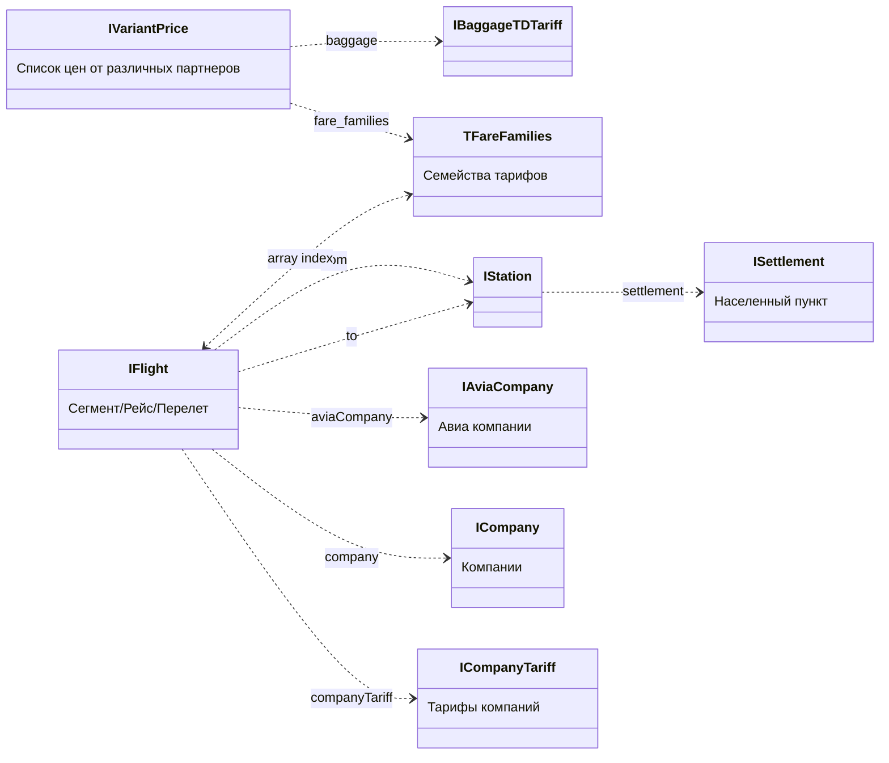

# Общее описание

Все запросы поиска идут к Ticket Deamon API

**Ручная кладь, багаж и возврат для каждого отдельного варианта определяются как худший из списка оферов парнтеров для данного варианта.**

## Flow обработки данных поиска

Данные по поиску мы получаем постепенно опрашивая метод api/avia/search/results (структура ответа см ниже)

Дальше мы делаем предварительную денормализацию данных и мерджим поступающие данные в этом коде src/redux/reducers/avia/utils/ticketDaemon/mergeTDAnswer.ts (метод mergeTDAnswer)

View данные вариантов поиска формируются в селекторе getAviaSearchVariants (src/redux/selectors/avia/search/getAviaSearchVariants.ts)

Варианты разбиваются на группы EAviaVariantGroupType:

-   удобный перелёт
-   лучшая цена
-   популярный рейс
-   продаёт авиакомпания
-   предложение с доступным BoY

Выходная структура данных которую мы используем на фронте IResultAviaVariant (src/redux/selectors/avia/utils/denormalization/variant.ts)

# Структура данных

Для описания диаграмм используется нотация [mermaid](https://mermaid-js.github.io/mermaid/#/)

## Общая диаграмма связей (более подробно см server/api/AviaTicketDaemonApi/types/IAviaTDAnswer.ts)

### Ответ Ticket Deamon содержит набор подходящих вариантов и набор справочников

```mermaid
classDiagram
    direction LR

    IAviaTDAnswer *-- IReference : reference
    IAviaTDAnswer *-- IVariants : variants

    IReference "1" *-- "many" IFlight : flights
    IReference "1" *-- "many" ISettlement : settlements
    IReference "1" *-- "many" IStation : stations
    IReference "1" *-- "many" TFareFamilies : fareFamilies
    IReference "1" *-- "many" IBaggageTDTariff : baggageTariffs
    IReference "1" *-- "many" IAviaCompany : aviaCompanies
    IReference "1" *-- "many" ICompany : companies
    IReference "1" *-- "many" ICompanyTariff : companyTariffs

    IVariants "1" *-- "many" IFare : fares

    IFare "1" *-- "many" IVariantPrice : prices
    IFare "forward" ..> "many" IFlight : route[0]
    IFare "return" ..> "many" IFlight : route[1]?

    ICompany ..> IAlliance : alliance
    ICompany <..> IAviaCompany : id

    class IAviaTDAnswer {
        reference : IReference
        variants : IVariants
        (Ответ Ticket Deamon API)
    }

    class IReference {
        flights : IFlight
        settlements : ISettlement
        stations : IStation
        fareFamilies : TFareFamilies
        baggageTariffs : IBaggageTDTariff
        aviaCompanies : IAviaCompany
        companies : ICompany
        companyTariffs : ICompanyTariff
        (Справочник данных)
    }

    class IVariants {
        fares: IFare
        (Список найденных вариантов)
    }

    class IFare {
        prices
        route
        (Конкретный вариант)
    }

```

### Связи вариантов со справочниками



### Перелеты

IFare содержит поле route - массив из двух элементов - массивов перелетов туда и обратно (элемент массива - ключ для справочника flights). Если нет обратного перелета - второй элемент пустой массив.

### Семейства тарифов варианта

Каждый вариант содержит массив цен-предложений от партнеров где есть поле fare_families. fare_families - массив из двух элементов наборов семейств тарифов для перелетов в каждую сторону (ключей для справочника fareFamilies). Если нет обратного перелета - второй элемент пустой массив.

**Если партнер не дал нам информацию по семейству тарифов для перелета туда то первый массив будет пустой**

**Если у варианта несколько перелетов в одном направлении и у нас нет семейства тарифов для одного из перелетов - то в массиве для соответствующего перелета будет значение null**

## Связь между конкретным перелетом и семейством тарифов:

-   ключ для перелета - индекс в массиве перелетов варианта
-   ключ для тарифа - индекс в массиве семества тарифов в цене варианта

## Бейджи (badge) на сниппете

Бейджи варианта формируются здесь src/projects/avia/components/AviaResultVariant/components/CardWithBadges/CardWithBadges.tsx:52
Есть 7 вариантов бейджа:

-   Дешевый
-   BoY
-   Продает авиакомпания
-   Комфортный
-   Популярный
-   Чартер
-   Особые условия

**отображаем не больше двух и часть из них взаимоисключающие**

## TODO рефакторинг авиа поиска

-   описать данные которые мы получаем от бэка (собрать описание в одном месте)
-   сгруппировать, актуализировать названия данных от бэка
-   описать view модель данных удобную и отвечающую потребностям фронта (собрать описание в одном месте)

    -   Variant
        -   selected tarrif (yellow button - best tariffs' offer)
        -   route
        -   badges
        -   tariffs
    -   Tariff
        -   best offer
        -   carry on
        -   baggage
        -   refund
        -   changing
        -   offers
    -   Offer
        -   price
        -   partner
    -   Route/Directions
        -   flights forward
        -   flights backward
    -   Flight
        -   company
        -   date depature
        -   date arrival
        -   duration

-   переделать механизм как мы обрабатываем данные бэка

    -   вынести 'сырые' данные из redux'а, хранить в redux только данные которые непосредственно отображаем (отдельный компонент/модуль/класс изолирующий обработку данных бэка, реализующий получение из этих данных подготовленных для отображения, реализующий сортировку и фильтрацию данных, покрытый юнит тестами)

-   необходимо сделать рефакторинг компонентов и привести названия к единной терминологии
    -   разграничить группу вариантов (variant group) и отдельный вариант/тариф (variant/tariff) -> сделать вариант то что сейчас группа вариантов, сделать тарифом то что сейчас вариант???
    -   разнести логику работы внутри каждого варианта
        -   вынести/изолировать данные и методы варианта в отдельный hook/context
        -   вынести layout'ы и простые компоненты вариантов
