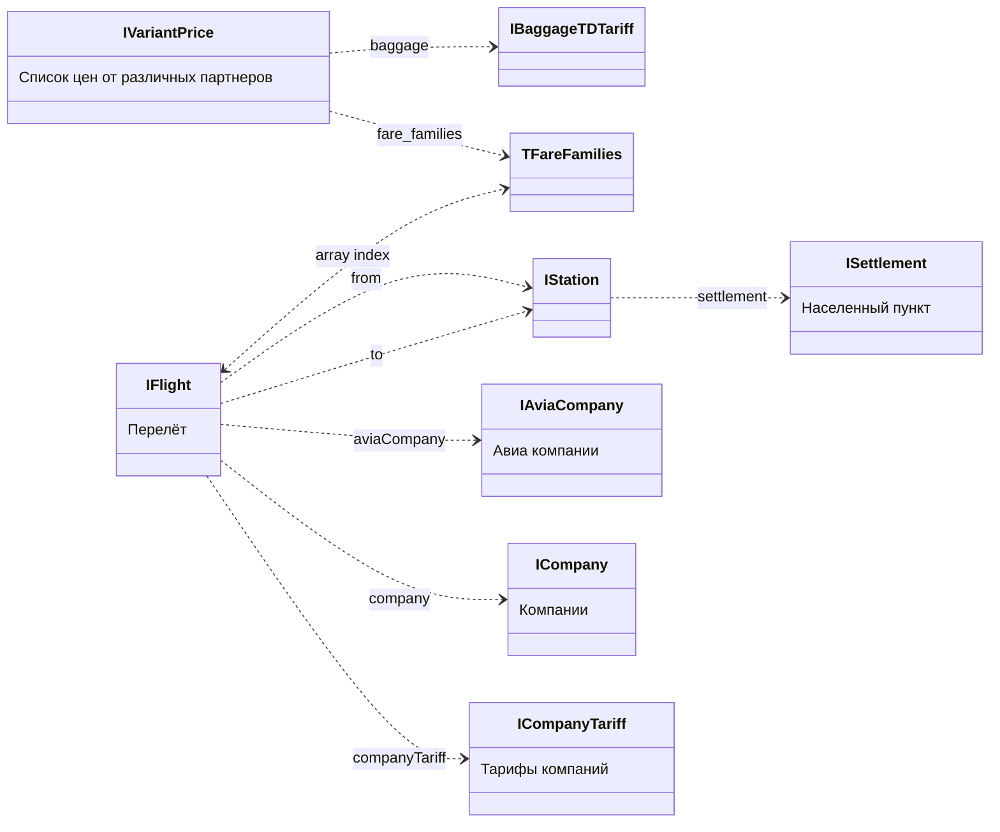

# Общее описание

Все запросы поиска идут к Ticket Deamon API

## Используемые термины

TODO
Партнер (partner)
Авиакомпания (avia company)
Вариант (variant)
Маршрут (route)
Перелет (flight)
Семейство тарифов (fare families)
Тариф (tariff) / Плата за проезд (fare)
Населенный пункт (settlement)
Ручная кладь (carry on)
Багаж (baggage)
Возврат (refund)

Ордер (order)

# Структура данных

Для описания диаграмм используется нотация [mermaid](https://mermaid-js.github.io/mermaid/#/)

## Общая диаграмма связей ([более подробно см](server/api/AviaTicketDaemonApi/types/IAviaTDAnswer.ts))

### Ответ Ticket Deamon содержит набор подходящих вариантов и набор справочников

```mermaid
classDiagram
    direction LR

    IAviaTDAnswer *-- IReference : reference
    IAviaTDAnswer *-- IVariants : variants

    IReference "1" *-- "many" IFlight : flights
    IReference "1" *-- "many" ISettlement : settlements
    IReference "1" *-- "many" IStation : stations
    IReference "1" *-- "many" TFareFamilies : fareFamilies
    IReference "1" *-- "many" IBaggageTDTariff : baggageTariffs
    IReference "1" *-- "many" IAviaCompany : aviaCompanies
    IReference "1" *-- "many" ICompany : companies
    IReference "1" *-- "many" ICompanyTariff : companyTariffs

    IVariants "1" *-- "many" IFare : fares

    IFare "1" *-- "many" IVariantPrice : prices
    IFare "1" ..> "many" IFlight : route

    class IAviaTDAnswer {
        reference : IReference
        variants : IVariants
        (Ответ Ticket Deamon API)
    }

    class IReference {
        flights : IFlight
        settlements : ISettlement
        stations : IStation
        fareFamilies : TFareFamilies
        baggageTariffs : IBaggageTDTariff
        aviaCompanies : IAviaCompany
        companies : ICompany
        companyTariffs : ICompanyTariff
        (Справочник данных)
    }

    class IVariants {
        fares: IFare
        (Список найденных вариантов)
    }

    class IFare {
        prices
        route
        (Конкретный вариант)
    }

```

###Связи вариантов со справочниками



### Перелеты

IFare содержит поле route - массив из двух элементов - массивов перелетов туда и обратно (элемент массива - ключ для справочника flights). Если нет обратного перелета - второй элемент пустой массив.

### Семейства тарифов варианта

Каждый вариант содержит массив цен-предложений от партнеров где есть поле fare_families. fare_families - массив из двух элементов наборов семейств тарифов для перелетов в каждую сторону (ключей для справочника fareFamilies). Если нет обратного перелета - второй элемент пустой массив.

**Если партер не дал нам информацию по семейству тарифов для перелета туда то первый массив будет пустой**

**Если у варианта несколько перелетов в одном направлении и у нас нет семейства тарифов для одного из перелетов - то в массиве для соответствующего перелета будет значение null**

## Связь между конкретным перелетом и семейством тарифов:

-   ключ для перелета - индекс в массиве перелетов варианта
-   ключ для тарифа - индекс в массиве семества тарифов в цене варианта
